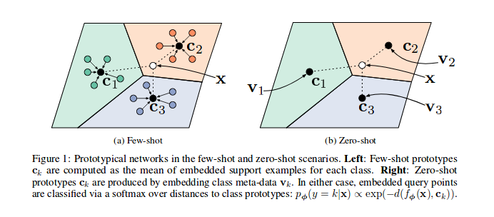
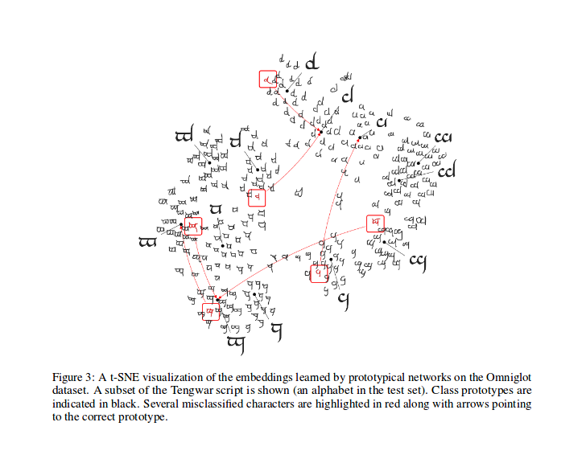

# Prototypical Networks for Few shot Learning in PyTorch
Simple Implementation of Prototypical Networks for Few Shot Learning (https://arxiv.org/abs/1703.05175) in Pytorch

## Prototypical Networks

As shown in the reference paper Prototypical Networks are trained to embed samples features in a vectorial space, in particular, at each episode (iteration), a number of samples for a subset of classes are selected and sent through the model, for each subset of class `c` a number of samples' features (`n_support`) are used to guess the prototype (their barycentre coordinates in the vectorial space) for that class, so then the distances between the remaining `n_query` samples and their class barycentre can be minimized.

## T-SNE 

After training, you can compute the t-SNE for the features generated by the model (not done in this repo, more infos about t-SNE [here](https://lvdmaaten.github.io/tsne/)), this is a sample as shown in the paper.

## Omniglot Dataset

Kudos to [@ludc](https://github.com/ludc) for his contribute: https://github.com/pytorch/vision/pull/46.
We will use the official dataset when it will be added to torchvision if it doesn't imply big changes to the code.

## Prototypical Batch Sampler

As described in its PyDoc, this class is used to generate the indexes of each batch for a prototypical training algorithm.

In particular, the object is instantiated by passing the list of the labels for the dataset, the sampler infers then the total number of classes and creates a set of indexes for each class ni the dataset. At each episode the sampler selects 'n_classes' random classes and returns a number (n_support + n_query) of samples indexes for each one of the selected classes.

## Prototypical Loss

Compute the loss as in the cited paper, mostly inspired by [this code](https://github.com/jakesnell/prototypical-networks/blob/master/protonets/models/few_shot.py) by one of its authors.

In [`prototypical_loss.py`](src/prototypical_loss.py) both loss function and loss class à la PyTorch are implemented. 

In particular, the functions takes in input the batch input from the model, the samples ground truths and the number `n_suppport` of samples to be used as support samples, so the function infers the episode classes from the target list, randomly extracts `n_support` samples for each class, computes their class barycentre, computes the distances of each remaining samples' embedding from each class barycentre and compute the probability of each samples of belonging to each episode class; the loss is then computed from the wrong predictions probabilities (for the query samples) as usual in classification problems.

## Training

Please note that the training code is here just for demonstration purposes. It use a pre-trained resnet model imported from the [torchvision](https://github.com/pytorch/vision/tree/master/torchvision) package as feature extractor and train only the last layer as a classifier.

## .bib citation
cite the paper as follows (copied-pasted it from arxiv for you):

    @article{DBLP:journals/corr/SnellSZ17,
      author    = {Jake Snell and
                   Kevin Swersky and
                   Richard S. Zemel},
      title     = {Prototypical Networks for Few-shot Learning},
      journal   = {CoRR},
      volume    = {abs/1703.05175},
      year      = {2017},
      url       = {http://arxiv.org/abs/1703.05175},
      archivePrefix = {arXiv},
      eprint    = {1703.05175},
      timestamp = {Wed, 07 Jun 2017 14:41:38 +0200},
      biburl    = {http://dblp.org/rec/bib/journals/corr/SnellSZ17},
      bibsource = {dblp computer science bibliography, http://dblp.org}
    }

## License

This project is licensed under the MIT License

Copyright (c) 2018 Daniele E. Ciriello, Orobix Srl (www.orobix.com).
